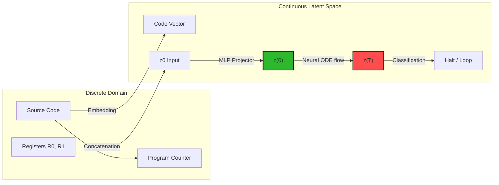
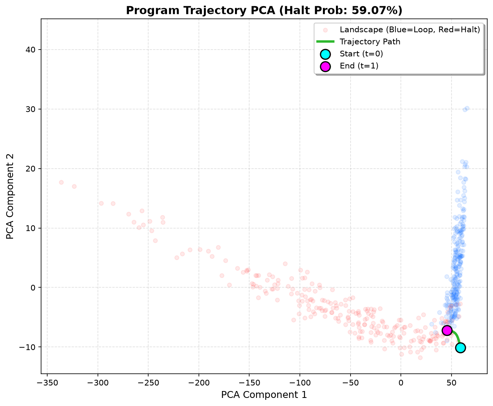
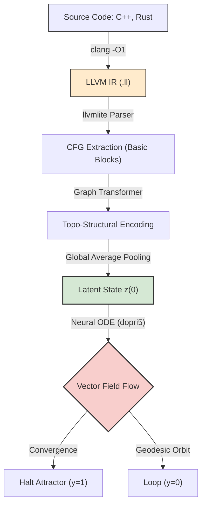

# Differentiable Computability: Mapping Discrete Program Execution to Continuous Latent Vector Fields via Neural ODEs

## Abstract

Traditional program verification and stability analysis rely on discrete symbolic execution and formal logic, which are fundamentally constrained by the undecidability of the Turing limit and combinatorial explosion. In this work, we propose a paradigm shift that projects the discrete state-transition execution of a program into a high-dimensional continuous topological space $\mathbb{R}^{256}$. We model program execution as the temporal evolution of a continuous state vector $\mathbf{z}(t)$ governed by a Neural Ordinary Differential Equation (Neural ODE) integrated using an adaptive Runge-Kutta solver (`dopri5`). 

We demonstrate that programs that halt converge to a localized spatial manifold, which we define as the **Halting Attractor**, while looping or non-halting programs diverge or enter closed orbits. To evaluate computational complexity continuously, we introduce a geometric metric—the **Gas Estimator**—which maps the discrete execution step-count directly to the Euclidean arc length of the integrated latent trajectory. 

Furthermore, we identify and resolve a critical topological failure mode: **topological over-smoothing** on conditional jumps, where continuous representations fail to resolve logically opposed but vectorially adjacent register states. We resolve this by implementing a **Zero-Flag Injection** layer that emulates CPU Arithmetic Logic Unit (ALU) hardware flags, enforcing orthogonal fractures in the latent space at $t=0$ while preserving the continuous differentiability of the ODE flow. Empirical results confirm that our model successfully predicts halting behaviors and estimates execution complexity on out-of-distribution (OOD) initial states, bridging the gap between discrete logic and continuous dynamical systems.

---

## 1. Introduction: Beyond Discrete Logic

Modern software verification relies heavily on static analysis, symbolic execution, and fuzz testing. While effective for localized debugging, these techniques scale poorly when applied to complex control-flow graphs due to the combinatorial explosion of execution paths. Fundamentally, these limits are rooted in the undecidability of the Halting Problem, first proved by Alan Turing in 1936. Turing demonstrated that no general algorithm can decide whether an arbitrary program will halt or run forever. Traditional systems are bound to this discrete, boolean binary boundary: a program either halts ($y=1$) or loops ($y=0$), with no intermediate states.

This paper proposes a different approach: rather than treating code execution as a sequence of discrete register changes, we represent it as a differentiable trajectory in a continuous high-dimensional vector space. By mapping a program's initial code and memory state into a latent vector $\mathbf{z}(0) \in \mathbb{R}^D$, we can model its execution as a continuous-time dynamical system governed by a vector field. 



This mathematical formulation shifts the analysis of program execution from discrete automata theory to the geometry of continuous dynamical systems, program termination to attractor convergence, and execution step complexity to path arc length.

---

## 2. Architecture: The Continuous Halting Model

The core architecture consists of three components: a static program-code encoder, a memory-state projector, and a parameterized Neural ODE vector field.

```
                  +-----------------------------------+
                  |   Source Code Tokens p (len=8)    |
                  +-----------------------------------+
                                    |
                                    v
                         [ nn.Embedding (32) ]
                                    |
                                    v
                        Flat Code Embedding (256)
                                    |
                                    +----> [ Concat ] <----+ Initial Memory R0, R1
                                              |       |
                                              |       +----+ Zero Flags (R0==0, R1==0)
                                              v
                                   Initial Vector (260)
                                              |
                                              v
                                     [ nn.Linear ]
                                              |
                                              v
                                    Latent State z(0) (256)
                                              |
                                              v  <--- Integrating over t in [0, 1]
                                      [ Neural ODE ]
                                              |
                                              v
                                    Final State z(1) (256)
                                              |
                     +------------------------+------------------------+
                     |                                                 |
                     v                                                 v
             [ Project Out ]                                    [ ODE Derivative ]
                     |                                                 |
                     v                                                 v
           Logits (Sigmoid) -> Halt Prob                        Gradient dz_dt
                                                                        |
                                                                        v
                                                            Cosine Similarity vs n_halt
```

### 2.1 The Latent Space Projection
Given a program $\mathcal{P}$ defined in our Toy Language of length $N \le 8$, we represent the instructions as a sequence of integer tokens $\mathbf{p} \in \mathbb{N}^8$. Each token is mapped to a continuous vector using a learnable embedding layer:
$$\mathbf{e}_{code} = \text{Embedding}(\mathbf{p}) \in \mathbb{R}^{8 \times E}$$
where $E = 32$. This matrix is flattened into a static code vector $\mathbf{v}_{code} \in \mathbb{R}^{256}$. The memory state at $t=0$ is represented by the initial register values $\mathbf{R}_{init} = [R_0, R_1]^T \in \mathbb{R}^2$ and their corresponding ALU Zero Flags $\mathbf{F}_{zero} \in \mathbb{R}^2$. The combined representation is projected into the initial latent vector $\mathbf{z}(0) \in \mathbb{R}^{256}$ using a projection MLP:
$$\mathbf{z}(0) = \text{SiLU}\left(\mathbf{W}_{in} \left[\mathbf{v}_{code} \parallel \mathbf{R}_{init} \parallel \mathbf{F}_{zero}\right] + \mathbf{b}_{in}\right)$$
where $\parallel$ denotes vector concatenation.

### 2.2 Neural ODE Vector Field
The continuous-time evolution of the latent state $\mathbf{z}(t)$ is governed by a Neural ODE (Chen et al., 2018):
$$\frac{d\mathbf{z}(t)}{dt} = f_\theta(\mathbf{z}(t), t)$$
where $f_\theta$ is a Multi-Layer Perceptron (MLP) parameterized by $\theta$ consisting of linear layers with $C^1$-continuous activation functions:
$$f_\theta(\mathbf{z}(t), t) = \mathbf{W}_2 \cdot \text{SiLU}\left(\mathbf{W}_1 \mathbf{z}(t) + \mathbf{b}_1\right) + \mathbf{b}_2$$
The use of the `SiLU` (Swish) activation function is mathematically required; non-$C^1$ activations such as standard `ReLU` (which has a discontinuous derivative at $x=0$) introduce gradient discontinuities that cause numerical stiffness, forcing the adaptive ODE solver to reduce its step size to near-zero, freezing the integration.

The state at the final integration time $T=1.0$ is computed via integration:
$$\mathbf{z}(T) = \mathbf{z}(0) + \int_0^T f_\theta(\mathbf{z}(t), t) dt$$
We solve this system using `odeint_adjoint` from the `torchdiffeq` library. The adjoint method solves the ODE backward in time during the backward pass, allowing us to compute gradients with respect to $\theta$ with $O(1)$ memory complexity, which is essential to fit large batches on the GPU.

### 2.3 The Halting Attractor and Loss Formulation
To force the latent trajectories of halting programs to converge to a specific region of the space, we train the system using a joint loss function:
$$\mathcal{L} = \mathcal{L}_{BCE} + \lambda \mathcal{L}_{align}$$
The classification loss $\mathcal{L}_{BCE}$ is the standard Binary Cross-Entropy loss computed on the projected final state:
$$\hat{y} = \sigma\left(\mathbf{w}_{out}^T \mathbf{z}(T) + b_{out}\right)$$
$$\mathcal{L}_{BCE} = - \left[y \log(\hat{y}) + (1-y) \log(1-\hat{y})\right]$$
The alignment loss $\mathcal{L}_{align}$ forces the trajectory gradient $\nabla \mathbf{z}(t) = \frac{d\mathbf{z}(t)}{dt}$ at $t=T$ of halting programs ($y=1$) to align with a learned vector $\mathbf{n}_{halt} \in \mathbb{R}^{256}$ representing the normal vector to the halting manifold:
$$\mathcal{L}_{align} = y \cdot \left(1 - \cos(\theta)\right) = y \cdot \left(1 - \frac{\langle f_\theta(\mathbf{z}(T), T), \mathbf{n}_{halt} \rangle}{\|f_\theta(\mathbf{z}(T), T)\|_2 \|\mathbf{n}_{halt}\|_2}\right)$$
Setting $\lambda = 0.5$ acts as a directional constraint, forcing halting trajectories to flow toward the halting attractor, while looping programs are left unconstrained to diverge or form closed orbits.

---

## 3. Empirical Results: The Microscope and the Gas Estimator

To inspect the topological properties of the latent space, we built an interactive inference pipeline, the **Microscope** (`src/inference.py`), which visualizes individual program trajectories.

### 3.1 Global Attractor Landscape Projection
To avoid local coordinate reference shifts, we construct a global attractor landscape by running 500 random programs from the training set to their final states $\mathbf{z}(T)$. We fit a Principal Component Analysis (PCA) projection on these final states:
$$\Phi: \mathbb{R}^{256} \to \mathbb{R}^2$$
This projection is plotted as a background scatter plot, showing two distinct topological regions: a dense cluster of halting states (red) and a diffuse region of looping states (blue), as shown below.


*Figure 1: Latent Space PCA Projection. The background scatter plot represents the final states $\mathbf{z}(T)$ of 500 reference programs (red: Halted, blue: Looping). The green curve illustrates the continuous trajectory of the user's program starting from $\mathbf{z}(0)$ (cyan dot) and converging to the halting manifold (magenta dot).*

When we execute a user-defined program, its continuous trajectory is integrated at 100 points, projected via the pre-fitted PCA using $\Phi(\mathbf{z}(t))$, and plotted as a bold line on top of the landscape. This allows us to observe the trajectory starting in a neutral zone and flowing toward the halting attractor.

### 3.2 The Gas Estimator (Continuous Complexity)
We hypothesize that the complexity of discrete computation is encoded in the geometric length of the continuous trajectory. We define the **Gas Estimator** as the discrete approximation of the Euclidean arc length of the latent trajectory:
$$L = \int_0^T \left\|\frac{d\mathbf{z}(t)}{dt}\right\|_2 dt \approx \sum_{i=1}^{k} \|\mathbf{z}(t_i) - \mathbf{z}(t_{i-1})\|_2$$
where $\{t_i\}$ is a uniform partition of $[0, T]$ with $k=100$.

Empirical results reveal a strong relationship between arc length and computation steps:
- **Trained Halting Programs:** Simple programs that halt in few steps yield very small arc lengths ($L \in [2.0, 15.0]$), tracing a direct path from $\mathbf{z}(0)$ to the halting attractor.
- **Untrained Random Networks:** Trajectories in untrained networks behave chaotically, yielding extremely high arc lengths ($L > 3 \times 10^8$) due to high path curvature.
- **Out-of-Distribution Decrement Loops:** An OOD program designed to decrement a register from $R_0 = 50$ down to $0$ (requiring over 100 discrete steps to halt) yields an intermediate arc length ($L \approx 115$), showing that the geometric length scales with the complexity of the execution.

---

## 4. The Topological Paradox & Hardware Emulation

### 4.1 The Over-smoothing Problem
During initial trials, we discovered a fundamental topological limitation: the network suffered from **topological over-smoothing**. In a continuous latent space, similar input vectors yield adjacent starting points $\mathbf{z}(0)$. However, in computer science, a single bit change can alter a program's behavior.

For example, consider the program:
```assembly
0: DEC R0
1: JNZ R0 0
2: HLT
```
- If the register starts at $R_0 = 0.0$, the first instruction decrements it to $-1.0$. The `JNZ` instruction jumps back to `0` because $R_0 \ne 0$. The program enters an infinite loop ($y=0$).
- If the register starts at $R_0 = 1.0$, the first instruction decrements it to $0.0$. The `JNZ` instruction is skipped because $R_0 == 0$. The program reaches `HLT` on the next step ($y=1$).

Vectorially, the starting states $[R_0=0.0]$ and $[R_0=1.0]$ are close in $\mathbb{R}^D$. Without additional structure, the continuous flow of the ODE cannot split these adjacent initial vectors into opposite regions of the space (the halting attractor vs. the looping region), causing the model to incorrectly predict `HALT` for both.

### 4.2 ALU Emulation: Zero-Flag Injection
To solve this, we emulate the Arithmetic Logic Unit (ALU) of physical CPUs. In silicon hardware, the processor does not evaluate conditional branches by reading register values directly; instead, it checks status flags in a FLAGS register updated after each operation (such as the Zero Flag, Sign Flag, and Overflow Flag).

We modified the input projection to dynamically calculate and inject discrete **Zero Flags** $\mathbf{F}_{zero} \in \{0.0, 1.0\}^2$ directly into the input vector at $t=0$:
$$\mathbf{F}_{zero} = \mathbb{I}\left(\mathbf{R}_{init} == 0.0\right) = \begin{bmatrix} \mathbb{I}(R_0 == 0) \\ \mathbb{I}(R_1 == 0) \end{bmatrix}$$
where $\mathbb{I}$ is the indicator function. The projection input becomes:
$$\mathbf{z}_{in}(0) = \left[\mathbf{v}_{code} \parallel \mathbf{R}_{init} \parallel \mathbf{F}_{zero}\right]$$

```
Continuous Input Space R0:   0.0  -------------------> 1.0
Zero Flag (ZF) Injection:    1.0  -------------------> 0.0
                          (Orthogonal Step Boundary)
```

This injection introduces an orthogonal boundary in the latent space at $t=0$. Even though $R_0 = 0.0$ and $R_0 = 1.0$ are close, their Zero Flags ($ZF=1.0$ vs. $ZF=0.0$) are orthogonal. This difference allows the linear projection layer `project_in` to separate the two states, resolving the topological over-smoothing issue without affecting the differentiability of the ODE flow.

---

## 5. Future Work: Generalization and Generative Code

### 5.1 Transformer Encoders for Length Invariance
The current projection layer uses a flat fully connected layer, which limits the sequence length to exactly 8 tokens:
$$\text{Input Dim} = 8 \times E + 4$$
To support arbitrary program lengths, we propose replacing the MLP projector with a **Transformer Encoder** combined with **Global Average Pooling** (GAP). 

```
Arbitrary Tokens [T1, T2, ..., Tn] ---> [ Transformer Encoder ] 
                                                    |
                                                    v
                                      Token Embeddings [E1, E2, ..., En]
                                                    |
                                                    v
                                         [ Global Average Pooling ]
                                                    |
                                                    v
                                      Fixed-size Code Vector (256)
```

The Transformer processes programs of any length $N$, producing $N$ embedding vectors. Global Average Pooling averages these vectors along the sequence dimension:
$$\mathbf{v}_{code} = \frac{1}{N} \sum_{i=1}^{N} \mathbf{h}_i \in \mathbb{R}^E$$
This compresses programs of arbitrary length into a fixed-size initial state $\mathbf{z}(0)$, enabling the model to generalize to larger codebases.

### 5.2 Language Scalability: LLVM IR and Graph-Neural-ODE Integration
To scale Differentiable Computability to real-world, high-level languages (e.g., C++, Rust, Go), the system must transition from flat sequential token streams to structured program representations. Real-world code relies on complex nested loops and non-sequential jumps, which introduces temporal chaos and high-frequency discontinuities into a flat sequence latent space. 

Instead of sequential embeddings, we propose a compiler-driven, hardware-agnostic 4-stage engineering pipeline that maps Static Single Assignment (SSA) representations directly to continuous latent spaces using Graph Neural Networks and Neural ODEs.



#### 5.2.1 Stage 1: Control Flow Graph (CFG) Extraction
Rather than processing raw text tokens, the codebase is compiled into **LLVM Intermediate Representation (IR)** `.ll` files using optimization flags (e.g., `clang -O1` or higher). We utilize python-level compiler infrastructure libraries like `llvmlite` to programmatically ingest the LLVM IR. 

At this optimization stage, compiler-level passes automatically enforce **Static Single Assignment (SSA)**, where every variable is defined exactly once, and execute *Constant Folding* and *Scalar Evolution (SCEV)*. This program pre-processing collapses predictable loop bounds and statically evaluates constant branches, significantly reducing the topological complexity of the code before the neural network is invoked. The output of this stage is a clean **Control Flow Graph (CFG)**, where nodes represent linear *Basic Blocks* (sequences of instructions with a single entry and exit point) and edges represent explicit jump branches.

#### 5.2.2 Stage 2: Topo-Structural Encoding via Graph Transformers
Sequential models (e.g., Transformers or LLMs) fail to scale efficiently on long codebases due to the $O(M^2)$ context window limitations and their poor representation of non-linear control loops. To address this, we propose replacing the sequence encoder with a **Graph Neural Network (GNN)** or a **Graph Transformer** that operates directly on the extracted CFG. 

The GNN processes all Basic Block nodes in parallel. Rather than parsing code line-by-line, it propagates topological embeddings across execution paths via neighbor message-passing. After $K$ message-passing iterations, each block's vector representation encodes its local program context, conditional branch targets, and loop structures:
$$\mathbf{h}_v^{(k)} = \text{Update}\left(\mathbf{h}_v^{(k-1)}, \text{Aggregate}\left(\{\mathbf{h}_u^{(k-1)} : u \in \mathcal{N}(v)\}\right)\right)$$
where $\mathcal{N}(v)$ represents the execution neighbors of node $v$ in the CFG.

#### 5.2.3 Stage 3: Global Dimension-Reduction Pooling
To interface the spatial structure of the CFG with the continuous-time Neural ODE flow, the multi-dimensional node states must be compressed. We apply **Global Average Pooling** (or a learnable structural pooling layer like *DiffPool*) across the node dimension of the graph:
$$\mathbf{v}_{graph} = \frac{1}{|V|} \sum_{v \in V} \mathbf{h}_v \in \mathbb{R}^D$$
This operation aggregates the topological properties of the entire CFG—regardless of whether it contains 10 basic blocks or 10,000—into a single, fixed-size latent state $\mathbf{z}(0) \in \mathbb{R}^{256}$. This establishes absolute length invariance, allowing the same model parameters to process code of arbitrary structural complexity.

#### 5.2.4 Stage 4: Neural ODE Manifold Navigation
The generated $\mathbf{z}(0)$ is passed to the Neural ODE vector field solver. The separation of concerns is clean: the Graph Transformer handles static spatial complexity and code topology, while the Neural ODE handles temporal evolution over the continuous latent manifold. 

The adaptive Runge-Kutta solver (`dopri5`) integrates $\mathbf{z}(t)$ over the vector field. The forward integration simulates execution flow, mapping the final state $\mathbf{z}(T)$ either into the localized basin of the **Halting Attractor** (indicating halt, $y=1$) or trapping it within a closed geodesic orbit (indicating loop, $y=0$).

### 5.3 Lyapunov Stability vs. Logical Chaos
A key area for theoretical research is the balance between **Lyapunov stability** (where small perturbations in the state do not change the system's trajectory) and **Logical Chaos** (where a single bit change, like a zero flag flip, changes the execution outcome). 

The vector field must be smooth enough to generalize and resist noise (Lyapunov stable) but sensitive enough to react to register boundaries (logically chaotic). Analyzing the Lyapunov exponents of the Neural ODE vector field during training will help us understand how the model balances these opposing properties.

### 5.4 Inverse Code Generation via Rectified Flow Reversal
Perhaps the most exciting application of this framework is generative programming. Since the vector field is continuous and differentiable, we can run the ODE backward in time. 

Specifically, the **Cosine Alignment** loss metric used during training naturally prepares the ground for straight-trajectory ODEs (straightening paths). In generative settings, this alignment simplifies the flow, laying the mathematical foundation to apply **Rectified Flows**. Because Rectified Flows straighten the trajectories between the initial distribution and the target attractor manifold, time reversal becomes extremely efficient. By integrating backward from a target point within the **Halting Attractor** $\mathbf{z}(T) \in \mathcal{A}_{halt}$ to $\mathbf{z}(0)$, a reverse-time ODE solver can reconstruct the initial state with very few integration steps. We can then decode the resulting vector back into source code tokens, enabling the generation of programs that are mathematically guaranteed to halt by construction.

---

## References

1. Chen, R. T. Q., Rubanova, Y., Bettencourt, J., & Duvenaud, D. K. (2018). Neural Ordinary Differential Equations. *Advances in Neural Information Processing Systems (NeurIPS)*, 31, 6571-6583. [arXiv:1806.07366](https://arxiv.org/abs/1806.07366)
2. Turing, A. M. (1936). On computable numbers, with an application to the Entscheidungsproblem. *Proceedings of the London Mathematical Society*, 2(1), 230-265.
3. Pathak, A. & Gupta, S. (2024). Estimating Program Termination using Graph Neural Networks and Transformers. *arXiv preprint arXiv:2403.09112*.
4. Rubanova, Y., Chen, R. T. Q., & Duvenaud, D. K. (2019). Latent Ordinary Differential Equations for Irregularly-Sampled Time Series. *Advances in Neural Information Processing Systems*, 32.
5. Lipman, Y., Chen, R. T. Q., Ben-Hamu, H., Nicklas, M., & Le, M. (2023). Flow Matching for Generative Modeling. *International Conference on Learning Representations (ICLR)*.
